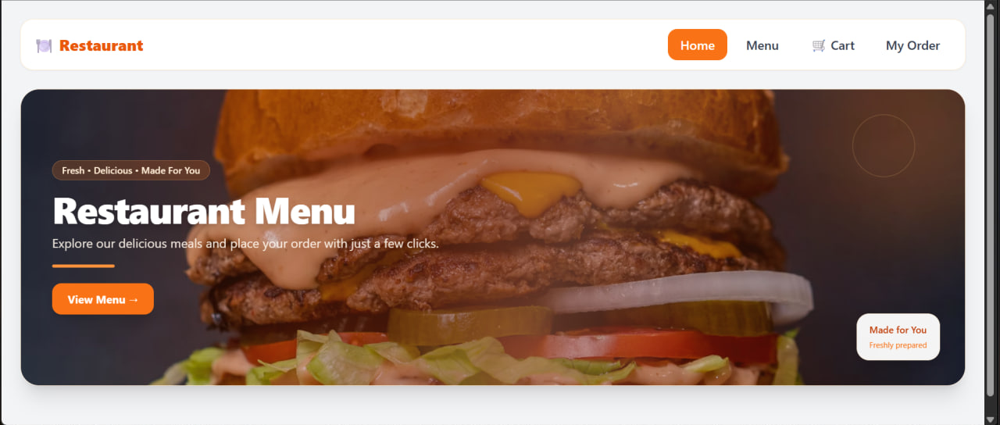
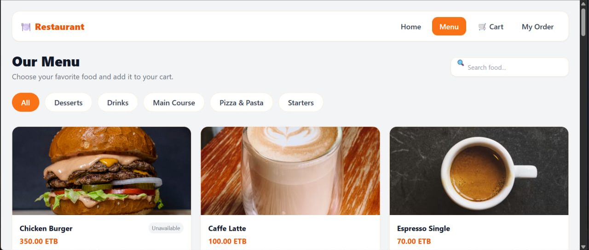
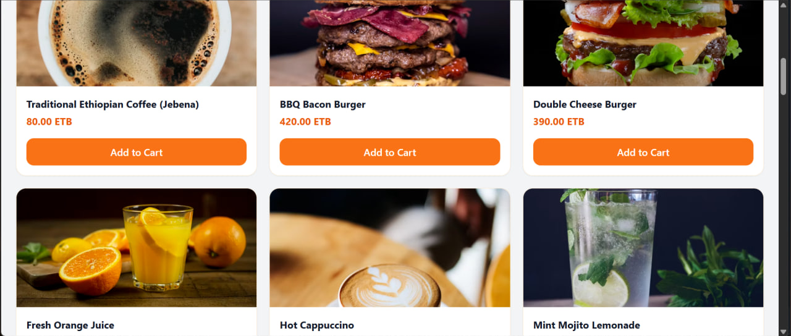
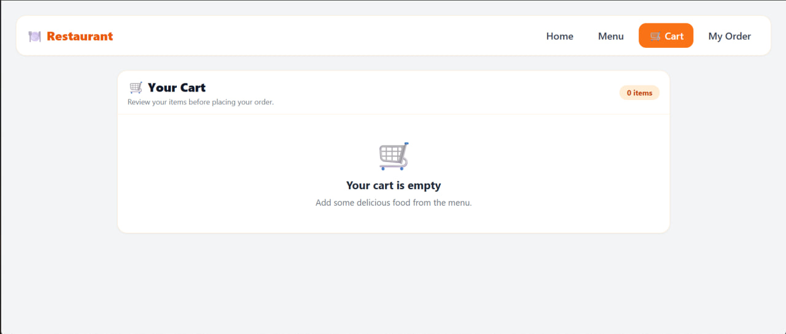
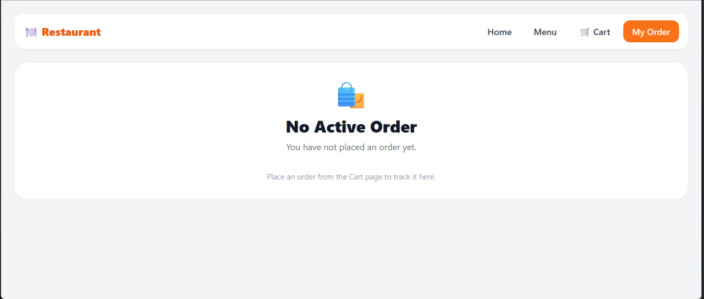
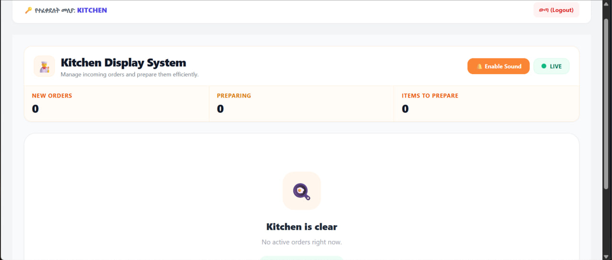

# 🍽️ Restaurant Ordering System

A full-stack restaurant ordering system that allows customers to browse a digital menu, add items to their cart, place orders, and track order status in real time.

Built as an individual full-stack project to practice modern frontend development, backend APIs, database integration, and real-time communication.

## 📸 Screenshots

### 🏠 Home



### 🍔 Menu



### 🍽️ Menu Items



### 🛒 Cart



### 📦 Order Tracking



### 👨‍🍳 Kitchen Display



## ✨ Features

### Customer

- Scan a table QR code
- Browse the restaurant menu
- Search and filter food items
- Add items to cart
- Place orders
- Track order status

### Kitchen

- View incoming orders
- Start preparing orders
- Mark orders as completed
- Cancel orders
- Receive orders in real time

### Manager / Admin

- View restaurant analytics
- Manage menu items
- Enable or disable menu items
- Archive menu items
- Generate table QR codes

## 🛠️ Tech Stack

### Frontend

- React
- Vite
- Tailwind CSS
- React Router
- Axios
- Socket.IO Client
- Recharts

### Backend

- Node.js
- Express.js
- MySQL
- Socket.IO
- CORS
- dotenv

### Database

- MySQL
- XAMPP / phpMyAdmin

## 🔄 How It Works

```text
Customer
   │
   ▼
Scan Table QR
   │
   ▼
Browse Menu
   │
   ▼
Add Items to Cart
   │
   ▼
Place Order
   │
   ▼
Backend API
   │
   ├──────────────► MySQL Database
   │
   ▼
Socket.IO
   │
   ▼
Kitchen Display
   │
   ▼
Update Order Status
   │
   ▼
Customer Tracks Order

📁 Project Structure
restaurant-ordering-system/
├── backend/
│   ├── .env.example
│   ├── db.js
│   ├── package.json
│   └── server.js
│
├── database/
│   └── schema.sql
│
├── frontend/
│   ├── src/
│   ├── package.json
│   └── vite.config.js
│
├── screenshots/
│   ├── home.png
│   ├── menu-top.png
│   ├── menu-items.png
│   ├── cart.png
│   ├── order-tracking.png
│   └── kitchen.png
│
├── README.md
└── .gitignore
🔐 Environment Variables

The backend uses environment variables for database configuration and staff PINs.

Create a .env file inside the backend/ directory based on .env.example.

PORT=5000

DB_HOST=localhost
DB_PORT=3306
DB_USER=root
DB_PASSWORD=
DB_NAME=restaurant_db

ADMIN_PIN=your_admin_pin
KITCHEN_PIN=your_kitchen_pin

🚀 Running the Project Locally
1. Clone the repository
git clone https://github.com/TnebebZewdu/restaurant-ordering-system.git
cd restaurant-ordering-system
2. Set up the database
Start MySQL using XAMPP.
Open phpMyAdmin.
Create the required database.
Import:
database/schema.sql
3. Start the backend
cd backend
npm install
npm start

The backend runs on:

http://localhost:5000
4. Start the frontend

Open another terminal:

cd frontend
npm install
npm run dev

Then open the local URL shown by Vite.

🔑 Authentication Note

The current staff authentication is designed for this project/demo environment.

Admin and kitchen PINs are stored through environment variables rather than being hardcoded in the source code.

🌱 Future Improvements
Production-ready authentication
Role-based authorization
Online payment integration
Cloud database deployment
Production deployment
Improved mobile responsiveness
Automated testing
Order history and customer accounts
👨‍💻 Author

Tnebeb Zewdu

Software Engineering Student | Full-Stack Developer

GitHub: @TnebebZewdu
```
